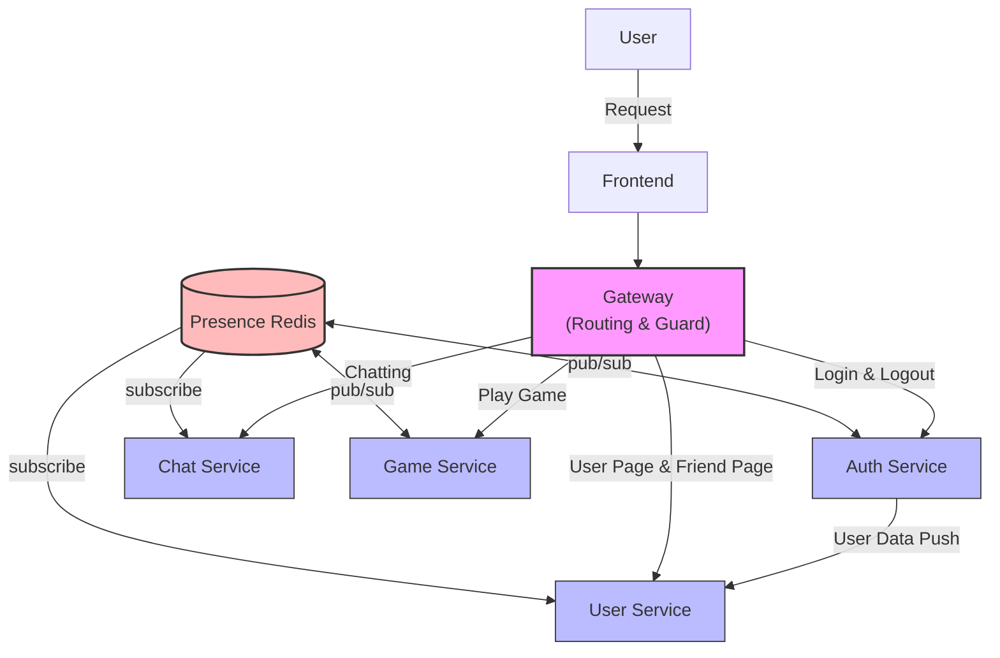

<p align="center">
  <a href="https://42.fr/en/homepage/" target="blank">
    
  </a>
</p>

<p align="center">
  
  
  
</p>

<p align="center">
  <b>Final Core Curriculum Project: Real-Time Multi-Service Web Platform at 42 Paris.</b><br>
  A high-performance collaborative single-page application featuring real-time pong gameplay, chats, and dynamic matchmaking.
</p>

<p align="center">
  
  
  
  
  
  
  
</p>

---

# 1. Team

## 1.1 Team Information
- daeunki2, suna, chanypar, tronguye

## 1.2 Project Management
- We applied a Git-based branching strategy and version control workflow, and documented progress in the `team_log`.
- We combined real-time communication through messaging apps with regular meetings to share issues quickly and make decisions efficiently.
- Based on shared learning, we designed the architecture together and then divided schedules and implementation scope by role.

## 1.3 Individual Contributions
To maintain high agility, we did not divide the team into strict "Frontend vs Backend" roles. Instead, **all members acted as Full-Stack Developers**, but we assigned specific administrative and architectural leads to ensure project stability:

1. **daeunki2 : Product Owner + Technical Lead + Project Manager + Full-Stack Developers**
	• Founded the project group and defined the overall product vision and direction.
  	• Led the team's sprint coordination while contributing to the full-stack implementation alongside all members.
2. **suna : Project Manager + Technical Lead + Full-Stack Developers**
	• Defined the technical architecture and implementation direction for their assigned services.
	• Developed core full-stack features from end to end.
3. **chanypar : Project Manager + Technical Lead + Full-Stack Developers**
	• Defined the technical architecture and implementation direction for their assigned services.
	• Developed core full-stack features from end to end.
4. **tronguye : Technical Lead + Front Developer**
  • Managed final bug fixing, error handling, and real-world integration testing to stabilize the application(e2e).

---


# 2. Project Overview

## 2.1 Description
### (1) Project Name
- ft_Pong
### (2) Goal
- **Hands-on Learning of Core Web Concepts:** We chose to build a Pong game to deeply understand and implement fundamental web communication protocols from scratch, specifically REST APIs and real-time WebSockets.
- **Experiencing Modern Architecture:** By building a decoupled Microservices Architecture (MSA), we learned firsthand how production-level, large-scale systems operate, communicate, and ensure fault isolation.
- **Focus on the Journey of Architectural Decisions:** Rather than simply checking off features to rush the project to completion, our ultimate focus was on the engineering process itself—deliberately analyzing how to structure our services, weighing architectural trade-offs, and choosing the right technology for each specific scenario.

### (3) Key Features

### 🚀 1. Loosely Coupled Microservices Architecture (MSA)
* **Domain Isolation:** Separated application core into 4 distinct Dockerized microservices—**Auth, User, Chat, and Game**—orchestrated through a centralized Nginx API Gateway to maximize fault isolation and scalability.
* **Event-Driven Presence Layer:** Integrated a **Redis Pub/Sub** network to synchronize live user presence states (Online/Offline/In-Game) cross-services smoothly without direct HTTP coupling.

### ⚡ 2. High-Performance 60 FPS Game Engine & Sync
* **Server-Side Physics Engine:** Implemented a robust game loop executing at a strict **60 FPS** on the backend to enforce state authority and eliminate client-side cheating or interpolation manipulation.
* **Resilient Connection-Drop Handling:** Engineered an immediate socket disconnection hook via WebSockets (Socket.io) that instantly detects link failures, gracefully resolves active game sessions, updates the Postgres DB, and awards forfeit victories to remaining players.

### 🔌 3. Scalable WebSockets Infrastructure (Chat, Game & Presence)
* **Full-Duplex Socket Architecture:** Designed and managed a centralized WebSockets (Socket.io) infrastructure to handle heavy concurrent connection lifecycles across distinct domains including real-time chatting, instant game invitations, and live global status syncing.
* **Stateful Connection Management:** Engineered custom socket-room management and multiplexing logic, allowing seamless peer-to-peer message routing within secure 1:1 DM sessions and instant, atomic synchronization of "Ready" status toggles within game matchmaking lobbies.

### 🎨 4. Dynamic UI/UX Theme Engine & Internationalization (Frontend)
* **Context-Driven Theme Switching:** Built a fully custom responsive UI from scratch featuring distinct **"Retro"** and **"Future"** concept themes toggleable via a single click. The UI dynamically transforms not just the color palette, but adapts the entire visual style and layout components to fit the selected aesthetic.
* **Native Multi-Language Support:** Integrated a scalable Internationalization (i18n) translation pipeline dynamically supporting **Korean, English, and French**, allowing instantaneous client-side layout adjustments without forcing application reloads.

### 🔐 5. Dual-Token Security Infrastructure with RTR
* **Strict Session Hijacking Defense:** Enforced a robust custom authentication system leveraging a dual-token standard (**Access & Refresh tokens**) delivered entirely via secure **HTTP-only browser cookies**.
* **Refresh Token Rotation (RTR):** Programmed an active rotation pipeline that invalidates used/compromised token chains immediately upon verification, mitigating replay attacks.
* **Role-Based Guards:** Designed targeted NestJS Authorization Guards to strictly separate "Guest" and "Registered User" interaction layers at the API route level.

### 📊 6. High-Availability Infrastructure Monitoring & Health Checks
* **Continuous Endpoint Verification:** Configured automated live health-check endpoints for all containerized microservices to ensure continuous service availability and rapid fault detection.
* **Centralized Live Status Dashboard:** Integrated **Uptime Kuma** to monitor real-time container status, response latency, and system uptime, guaranteeing high availability (HA) across the entire decentralized infrastructure.

## 2.2 Features List
- Sign up / Log in / Log out
- Cookie-based Access + Refresh token authentication with automatic token refresh
- Guest login and role separation between guest and registered users
- Profile retrieval and profile update (nickname, avatar upload)
- Friend request flow: send / accept / reject / remove
- Friend list and incoming request list retrieval
- Real-time 1:1 DM chat (Socket.io) with chat history retrieval
- Presence state synchronization (ONLINE / OFFLINE / IN_GAME)
- Game matchmaking (queue match), friend-invite match, and AI match
- Server-authoritative Pong gameplay with real-time input/state sync
- Game result persistence and per-user match history retrieval
- Service health checks (`/health`, `/health/ready`) and monitoring via Uptime Kuma

## 2.3 Modules

### (1) Selected Modules (Major / Minor + Points)
| Category | Module Name | Type | Points |
| :--- | :--- | :---: | :---: |
| **Web & Infrastructure** | Frontend & Backend Framework Integration | Major | 2 pts |
| | Real-time WebSockets Presence System | Major | 2 pts |
| | User Interaction & Relationship Management | Major | 2 pts |
| | Object-Relational Mapping (ORM) Integration | Minor | 1 pt |
| | Real-time Collaboration (Synchronized Game Lobby) | Minor | 1 pt |
| | Custom UI/UX Design & Theme Engine | Minor | 1 pt |
| | File Upload & Management (User Avatar Pipeline) | Minor | 1 pt |
| **Accessibility** | Multi-language Support (English / Korean / French) | Minor | 1 pt |
| **User Management** | Basic User Management & JWT Authentication | Major | 2 pts |
| | Match Statistics & Historical Game Logs | Minor | 1 pt |
| | Advanced Authorization System (RBAC via Guards) | Minor | 1 pt |
| **Artificial Intelligence** | AI Opponent Implementation (Server-side Bot) | Major | 2 pts |
| **Gaming Experience** | Fully Playable Server-side Web Game (Pong) | Major | 2 pts |
| | Remote Live Multiplayer Play (Low Latency) | Major | 2 pts |
| **DevOps & Monitoring** | Decentralized Microservices Architecture (MSA) | Major | 2 pts |
| | Container Health Checks & Live Status Dashboard | Minor | 1 pt |
| **Total Score** | **16 Modules Implemented** | | **24 pts** |

### (2) Why We Chose These Modules
We chose these modules because we wanted to experience, as closely as possible, the way large-scale services are designed and operated in real companies.

- We prioritized **service separation by domain** (Auth/User/Chat/Game) to practice fault isolation, independent ownership, and clearer boundaries.
- We adopted **real-time communication modules** (WebSocket, Presence, Matchmaking) to handle state synchronization problems that commonly appear in production systems.
- We selected **security-focused modules** (JWT, Refresh Token Rotation, role-based access control) to understand session lifecycle management and risk reduction in user-facing platforms.
- We included **operability modules** (health checks, monitoring dashboard, container orchestration) to practice not only feature development, but also runtime visibility and service reliability.
- We added **data persistence and history modules** to experience how business events (chat logs, game records, friendship state) are stored and queried across distributed services.

In short, the module set was intentionally designed to move beyond a single-server student project and simulate the engineering decisions required to run and maintain a production-style multi-service platform.

### (3) How They Were Implemented
#### 🌐 1. Web & Infrastructure (10 Points)
* **Frontend & Backend Framework (2 pts):** Built using a modern decoupled architecture—utilizing NestJS for a structured backend enterprise environment and React for a dynamic, component-driven client interface.
* **Web Socket Online (2 pts):** Implemented global, bi-directional state synchronization via Socket.io to manage and broadcast live user presence status (Online, Offline, In-Game) seamlessly.
* **User Interaction (2 pts):** Developed comprehensive social features including real-time Direct Messaging (DM), friend request systems.
* **ORM (1 pt):** Utilized TypeORM to seamlessly map relational business logic with our PostgreSQL database, ensuring type safety and efficient database migrations.
* **Real-time Collaboration (1 pt):** Developed synchronized game wating queue where a live session is automatically triggered for all connected participants once 2 players toggle their "Ready" status.
* **Custom Design (1 pt):** Crafted a fully custom, responsive user interface without relying on off-the-shelf pre-made templates. It features distinct "Retro" and "Future" concept themes toggleable via a single click, which dynamically transforms not only the color palette but also the entire visual style and layout components to match the active aesthetic.
* **File Upload (1 pt):** Allowed users to directly upload and customize their personal profile avatars. This features a secure, end-to-end file processing pipeline built with Multer that includes strict file size boundaries and extension validation (e.g., JPEG, PNG) to safeguard server-side storage.

#### 🌍 2. Accessibility & Internationalization (1 Point)
* **Multi-language Support (1 pt):** Integrated internationalization (i18n) workflows to natively support English, Korean, and French, dynamically adjusting layout components based on user language preferences.

#### 🔐 3. User Management & Security (4 Points)
* **Basic User Management & Auth (2 pts):** Implemented a complete custom authentication infrastructure featuring a dual-token system (Access & Refresh tokens) secured via HTTP-only browser cookies. To guarantee high-level security against session hijacking, we enforced a strict Refresh Token Rotation (RTR) mechanism that securely monitors and rotates tokens upon every verification lifecycle.
* **Game Statistics & Match History (1 pt):** Integrated a dedicated match history section within the user profile page. This allows players to review recent match logs at a glance, dynamically fetching and rendering game results, final scores, and opponent details directly from the database.
* **Advanced Authorization System (1 pt):** Enforced Role-Based Access Control (RBAC) via custom NestJS Guards to dynamically differentiate between "Guest" and "Registered User" accounts, restricting unauthorized access to core user features and locking down specific API endpoints.

#### 🤖 4. Artificial Intelligence (2 Points)
* **AI Opponent (2 pts):** Programmed a server-side automated game bot using physics-predictive algorithms, offering players an offline/training alternative to live matchmaking.

#### 🏓 5. Game & User Experience (4 Points)
* **Fully Playable Web Game (2 pts):** Developed a fully compliant implementation of classic Pong utilizing an independent server-side physics engine to prevent client-side manipulation.
* **Remote Live Play (2 pts):** Optimized low-latency multiplayer syncing across remote socket connections, running at a smooth and precise 60 FPS rendering rate. This includes a robust connection-drop handling system that instantly detects socket disconnections to gracefully forfeit matches upon unexpected user dropouts.

#### 🚀 6. DevOps & Monitoring (3 Points)
* **Microservices (2 pts):** Decoupled system responsibilities into individual Dockerized microservices—specifically isolating Auth, User, Chat, and Game services—to achieve a loosely coupled architecture bound by a centralized Nginx API Gateway. To efficiently sync live data without direct coupling, we integrated a Redis Pub/Sub presence layer that allows services to dynamically subscribe and fetch real-time user status updates.
* **Health Check & Status Page (1 pt):** Configured continuous service monitoring and health checks across all containerized microservices utilizing Uptime Kuma. This provides a centralized live status dashboard that tracks endpoint availability in real time to ensure high availability.
  
## 2.4 Technical Stack

### (1) Frontend
* **React & TypeScript:** Utilized to build a scalable, type-safe Single Page Application (SPA) with efficient component reusability.
* **Context API & Tailored CSS:** Engineered a fully custom style system without relying on pre-made external templates, implementing an on-the-fly "Retro" and "Future" concept theme-switching engine.
* **i18next (Internationalization):** Integrated a client-side translation pipeline to deliver seamless, native live-switching between Korean, English, and French.
* **Socket.io-client:** Established persistent full-duplex WebSockets connections to handle real-time chat sync, presence updates, and low-latency game 60 FPS state rendering.

### (2) Backend
* **NestJS (Node.js framework):** Adopted for its highly structured, modular architecture, enabling robust domain segregation and scalable enterprise-level API design.
* **Socket.io (WebSockets):** Managed full-duplex persistent connections across a centralized gateway to simultaneously drive the server-authoritative 60 FPS physics game engine, instant 1:1 direct messaging pipelines, and global user presence synchronizations.
* **JWT & Native NestJS Guards:** Built a multi-layered, proprietary authentication infrastructure completely from scratch. Engineered strict Access/Refresh token verification lifecycles combined with custom Refresh Token Rotation (RTR) logic directly at the framework route level without relying on third-party auth middlewares.
* **Docker & Docker Compose:** Containerized individual service layers to ensure strict environment consistency and seamless orchestration across development and staging environments.

### (3) Database & Caching
* **PostgreSQL:** Selected as the primary ACID-compliant relational database to strictly persist structured schemas including user credentials, relational friend graphs, and historic match logs.
* **TypeORM:** Implemented as the Object-Relational Mapper (ORM) to enforce type safety, streamline repository patterns, and handle safe programmatic database schema migrations.
* **Redis:** Deployed as an in-memory data store explicitly leveraged for its high-performance **Pub/Sub** capabilities, serving as an event-driven synchronization layer to broadcast live user presence data across distinct microservices.

### (4) Other Technologies
* **Uptime Kuma:** Deployed as a centralized, lightweight monitoring engine to continuously ping container health-check endpoints, track response latencies, and display active system uptime.
* **Make / Makefile:** Authored optimized automated build scripts to orchestrate complex multi-container Docker operations, environment variable setup, and immediate teardown commands via a single unified command interface.
* **Docker Network:** Configured isolated, secure internal bridge networks to facilitate high-speed, private inter-service communication between the microservices while blocking external exposure.
* **Notion & GitHub:** Leveraged as primary collaboration tools to maintain agile development sprints, track core feature milestones, manage strict Git branch conventions, and conduct peer code reviews.


## 2.5 Data Schema

### (1) Schema Overview
This project uses a database-per-service pattern. Each domain service owns its own PostgreSQL schema and does not perform cross-database joins.

| Service | Database | Core Tables |
| :--- | :--- | :--- |
| Auth Service | `auth-db` | `auth`, `refresh_sessions` |
| User Service | `user-db` | `users`, `friends` |
| Chat Service | `chat-db` | `chat_messages` |
| Game Service | `game-db` | `game_records` |

### (2) Core Tables
#### Auth Service
- `auth`: stores account identity (`id` UUID PK), `loginId` (nullable unique), hashed password (nullable for guest), and role (`member` / `guest`).
- `refresh_sessions`: stores refresh token sessions (`id` UUID PK) with `user_id` FK -> `auth.id`, token hash, expiry, and client metadata (user-agent/IP).

#### User Service
- `users`: stores profile identity (`userId` UUID PK), `loginId` (nullable unique), `nickname` (unique), `userPhoto`, and role.
- `friends`: stores friend relationship edges with `requesterId` and `addresseeId` (both indexed), `status` (`pending` / `accepted`), unique pair constraint, and self-request check constraint.

#### Chat Service
- `chat_messages`: stores direct messages with numeric PK (`id`), `senderId`, `receiverId`, message `content`, and `createdAt`.

#### Game Service
- `game_records`: stores finished game history with numeric PK (`id`), unique `gameId`, player IDs, winner/loser IDs and nicknames, scores, end reason (`normal` / `forfeit`), and played timestamp.

### (3) Cross-Service ID Contract
- User identity across services is represented by the same user UUID string (e.g., `auth.id` and `users.userId`).
- Services communicate by API/events (Gateway + Redis Pub/Sub), not by DB-level joins across databases.

### (4) Schema Management Policy (Current Code)
- `auth-service`, `user-service`: `synchronize` is environment-controlled via `TYPEORM_SYNCHRONIZE`.
- `chat-service`, `game-service`: `synchronize` is currently set to `true` in code.
- For production hardening, migration-based schema versioning is recommended.

## 2.6 System Architecture & Data Flow


---

# 3. Instructions

## 3. Instructions

### 3.1 Prerequisites
Before running the project, ensure you have the following software installed on your system:
* **Docker:** Version 20.10.0 or higher
* **Docker Compose:** Version 2.0.0 or higher
* **Make / Makefile utility** (pre-installed on macOS/Linux; required to run automated build scripts)

### 3.2 Installation
Clone the repository and navigate into the project root directory:
```bash
# Clone the repository
git clone <our-repository-url> ft_ts

# Move into the project directory
cd ft_ts

# Create .env files
touch .env gateway/.env auth-service/.env user-service/.env chat-service/.env game-service/.env

# Fill each .env file
# Copy the values from:
# https://github.com/daeunki2/ft_transcendence/tree/main/env_cmd.md

# (Fedora) Check your host IP address
hostname -I

# Replace DNS / host values with your IP where required
- Makefile
- gateway/.env
- chat-service/.env
- game-service/.env

```

### 3.3 Environment Setup (.env)
Use the following `.env` files and set values according to your environment.

#### Root `.env`
Used by `docker-compose.yml` to inject shared values into containers.

| Key | Purpose |
| :--- | :--- |
| `AUTHDB_USER`, `AUTHDB_PASSWORD` | Auth DB credentials |
| `USERDB_USER`, `USERDB_PASSWORD` | User DB credentials |
| `CHATDB_USER`, `CHATDB_PASSWORD` | Chat DB credentials |
| `GAMEDB_USER`, `GAMEDB_PASSWORD` | Game DB credentials |
| `PRESENCE_INTERNAL_TOKEN` | Internal token for trusted presence API calls |

#### `gateway/.env`
Used by API Gateway and Presence WebSocket.

| Key | Purpose |
| :--- | :--- |
| `MY_SECRET_KEY` | JWT verification/signing secret used at gateway level |
| `FRONTEND_ORIGIN` | Allowed frontend origin(s) for CORS (comma-separated if multiple) |
| `PRESENCE_INTERNAL_TOKEN` | Internal token to protect presence internal endpoints |

#### `auth-service/.env`
Used by authentication service.

| Key | Purpose |
| :--- | :--- |
| `PORT` | Auth service port (default: `4000`) |
| `MY_SECRET_KEY` | JWT secret used for token operations |
| `AUTHDB_USER`, `AUTHDB_PASSWORD` | Auth DB connection credentials |
| `TYPEORM_SYNCHRONIZE` | Controls schema auto-sync for auth service |
| `REDIS_HOST`, `REDIS_PORT` | Redis connection for session/presence-related flows |

#### `user-service/.env`
Used by user/profile/friend service.

| Key | Purpose |
| :--- | :--- |
| `PORT` | User service port (default: `4001`) |
| `MY_SECRET_KEY` | JWT secret for token verification |
| `USERDB_USER`, `USERDB_PASSWORD` | User DB connection credentials |
| `TYPEORM_SYNCHRONIZE` | Controls schema auto-sync for user service |
| `PRESENCE_INTERNAL_TOKEN` | Token used when calling gateway presence internal API |
| `PRESENCE_INTERNAL_BASE_URL` | Base URL for gateway internal presence API |

#### `chat-service/.env`
Used by chat service.

| Key | Purpose |
| :--- | :--- |
| `PORT` | Chat service port (default: `3002`) |
| `CHATDB_USER`, `CHATDB_PASSWORD` | Chat DB connection credentials |
| `REDIS_HOST`, `REDIS_PORT` | Redis connection for chat socket state/pub-sub |
| `FRONTEND_ORIGIN` | Allowed origin(s) for chat socket CORS |

#### `game-service/.env`
Used by game and matchmaking service.

| Key | Purpose |
| :--- | :--- |
| `PORT` | Game service port (default: `3003`) |
| `GAMEDB_USER`, `GAMEDB_PASSWORD` | Game DB connection credentials |
| `REDIS_HOST`, `REDIS_PORT` | Redis connection for queue/session/presence events |
| `FRONTEND_ORIGIN` | Allowed origin(s) for game socket CORS |


---

# 4. Resources

This section outlines the official documentations, development tools, core libraries, and infrastructure environments leveraged to architect and implement the microservices-based collaborative platform.

## 4.1 Technical Documentations & Specifications
* **NestJS Framework Documentation:** Used as the primary reference for structural architecture, dependency injection, and microservices configuration.
* **Docker & Docker Compose Reference Guides:** Referenced for multi-container virtualization, volume isolation, and container startup ordering (`depends_on`).
* **MDN Web Docs (HTTP & WebSockets):** Utilized to cross-reference HTTP status codes (e.g., 401 Unauthorized), CORS policies, Cookie attributes (`Secure`, `SameSite`), and the WebSocket API specification.
* **Socket.io Official Documentation:** Consulted for handling connection life-cycles, transport upgrades (Polling to WebSocket), and connection pool stability.
  
## 4.2 AI Usage

During the development of this project, Artificial Intelligence (AI) assistants (such as ChatGPT, Claude and Google Gemini) were utilized strictly as auxiliary tools to enhance development efficiency and conceptual understanding, ensuring all core logic and structural architecture were implemented manually.

#### 1. Implementation & Debugging
* **Purpose:** Used to generate boilerplate templates, optimize automated scripts (e.g., Makefiles), and accelerate the troubleshooting of complex environment configuration errors.
* **Application:** Assisted in structuring system multi-container setups (`docker-compose.yml`) and refining reverse-proxy settings for the API Gateway middleware to support WebSocket state-switching. AI was also leveraged to debug syntax edge-cases and race conditions within the microservice event-loops.

#### 2. Conceptual Learning & Architecture Research
* **Purpose:** Utilized to deeply understand advanced networking protocols, asynchronous I/O models, and microservices design patterns.
* **Application:** Provided structural clarity on the transition mechanism from HTTP Long-Polling to the WebSocket protocol (Protocol Upgrade). It was also used to study database indexing, JWT-based cross-origin authentication strategies, and the prevention of socket connection pool exhaustion under high-concurrency scenarios.

#### 3. Documentation & Translation
* **Purpose:** Employed to cross-reference official technical documentations and translate technical specifications accurately.
* **Application:** Used to translate RFC protocol standards and NestJS/Docker official guides from English to Korean for precise comprehension, and assisted in drafting clear, standardized technical documentation for the final project architecture.

## 4.3 Development Tools & Environment
* **Runtime Environment:** Node.js (v20), TypeScript (v5)
* **Containerization:** Docker Engine, Docker Desktop (Targeted for macOS Cluster / Fedora environments)
* **Security & Encryption:** OpenSSL (For generating local self-signed TLS/SSL certificates to enable HTTPS/WSS protocols)

## 4.4 Core Libraries & Dependencies
* **API Gateway & Routing:** `http-proxy-middleware` (for secure reverse-proxying and dynamic WebSocket upgrade handling)
* **Authentication:** `@nestjs/jwt` (JSON Web Token verification), `cookie-parser`
* **Real-time Transport:** `socket.io` & `socket.io-client`
